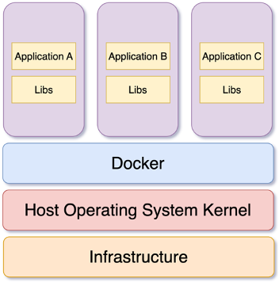

# Docker Containers

## What is a docker container?
- A container is an abstraction at the application layer that packages code and dependencies together. Instead of virtualizing the entire physical machine, containers virtualize the host operating system only.
- Just like virtual machines, containers are completely isolated environments from the host system as well as from each other. They are also a lot lighter than the traditional virtual machine, so a large number of containers can be run simultaneously without affecting the performance of the host system.‌

Unlike a virtual machine, a container does the job of virtualization in a smarter way. Instead of having a complete guest operating system inside a container, it just utilizes the host operating system via the container runtime while maintaining isolation – just like a traditional virtual machine.
The container runtime, that is Docker, sits between the containers and the host operating system instead of a hypervisor. The containers then communicate with the container runtime which then communicates with the host operating system to get necessary resources from the physical infrastructure.
As a result of eliminating the entire guest operating system layer, containers are much lighter and less resource-hogging than traditional virtual machines




## Managing Containers

1. **Running a container from an image**

```
docker run hello-world
```
---

This will fetch the latest `hello-world` image from the Docker Hub (if you don't already have it), create a new container, and run it. You should see a message stating that your installation appears to be working correctly.

- Running a different command in the container
```
docker run docker/whalesay cowsay 'Hello, StackExchange!'
```
---

This command tells Docker to create a container from the `docker/whalesay` image and run the command `cowsay 'Hello, StackExchange!'` in it. It should print a picture of a whale saying `Hello, StackExchange!` to your terminal.

- If the entrypoint in the image is the default you can run any command that's available in the image:

```
docker run docker/whalesay ls /
```
---

2. **Listing containers**

- To check currently running containers.
```
docker ps
```
---

- To view all containers (including stopped ones), use the `-a` flag:
```
docker ps -a
```
---

- To list containers with a specific status, use the `-f` command line option to filter the results. Here is an example of listing all containers which have exited
```
docker ps -a -f status=exited
```
---

3. **Finding a specific container**
```
docker ps --filter name=myapp_1
```
---

- To find out the IP address of your container,
```
docker inspect <container id> | grep IPAddress 
```
---

4. **Starting Containers**

To start a container which is stopped

```
docker start <container> [<container>...]
```
---

5. **Removing Containers**

- To remove a specific container

```
docker rm <container name or id>
```
---

- To remove all containers

```
docker rm $(docker ps -qa)
```
---

By default docker will not delete a container that is running. To remove a container, regardless of whether or not it is stopped, you can use the force flag `-f`: 

```
docker rm -f <container name or id>
```
---

- To remove all containers, regardless of state
```
docker rm -f $(docker ps -qa)
```
---

6. **Run a container in background**

To keep a container running in the background, supply the `-d` command line option during container startup:

```
docker run -d busybox
```
---

The option `-d` runs the container in detached mode. It is also equivalent to `-d=true`.

7. **Tagging a container**

By default, containers created with `docker run` are given a random name like `small_roentgen` or `modest_dubinsky`. 

These names aren't particularly helpful in identifying the purpose of a container. 
It is possible to supply a name for the container by passing the `--name` command line option:

```
docker run --name my-ubuntu ubuntu:14.04
```
---

Names must be unique; if you pass a name that another container is already using, Docker will print an error and no new container will be created.

8. **Binding a container port to the host**

```
docker run -p "8080:8080" myApp docker
```
---

In order to use ports on the host have been exposed in an image (via the `EXPOSE` Dockerfile directive, or `--expose` command line option for `docker run`), those ports need to be bound to the host using the `-p` or `-P` command line options. Using -p requires that the particular port (and optional host interface) to be specified. Using the uppercase `-P` command line option will force Docker to bind all exposed ports in a container's image to the host.

9. **Assigning a volume to a container**

A Docker volume is a file or directory which persists beyond the lifetime of the container. It is possible to mount a host file or directory into a container as a volume (bypassing the UnionFS).

Add a volume with the -v command line option:

```
docker run -d -v "/data" awesome/app bootstrap.sh
```
---

This will create a volume and mount it to the path `/data` inside the container.

*Mounting host directories*
To mount a host file or directory into a container:

```
docker run -d -v "/home/foo/data:/data" awesome/app bootstrap.sh
```
---


10. **Log into a running container**

A user can enter a running container in a new interactive bash shell with exec command.
Say a container is called `jovial_morse` then you can get an interactive, `pseudo-TTY bash shell` by running:

```
docker exec -it jovial_morse bash
```
---

- *Log into a running container as root*
If you want to log in as root, just simply use the `-u` root parameter. Root user always exists.

```
docker exec -it -u root jovial_morse bash
```
---

11. **Stopping a container**

```
docker stop mynginx
```
---

Additionally, the container id can also be used to stop the container instead of its name.

Further, the `kill` command can be used to immediately send a `SIGKILL` to stop a container.

```
docker kill mynginx
```
---

Stopping a container doesn't delete it. Use `docker ps -a` to see your stopped container.

12. **Debugging a container**

- *Entering in a running container*
To execute operations in a container, use the `docker exec` command. Sometimes this is called `"entering the container"` as all commands are executed inside the container.

```
docker exec -it container_id bash
```
---

or 

```
docker exec -it container_id /bin/sh
```
---

- *Monitoring resource usage*

Inspecting system resource usage is an efficient way to find misbehaving applications. This example is an equivalent of the traditional top command for containers:
```
docker stats
```
---

To follow the stats of specific containers, list them on the command line
```
docker stats 7786807d8084 7786807d8085
```
---

- *Printing container logs*
Following the logs is the less intrusive way to debug a live running application. This example reproduces the behavior of the traditional `tail -f` some-application.log on container `7786807d8084`.

```
docker logs --follow --tail 10 7786807d8084
```
---

This command basically shows the standard output of the container process (the process with `pid 1`).


