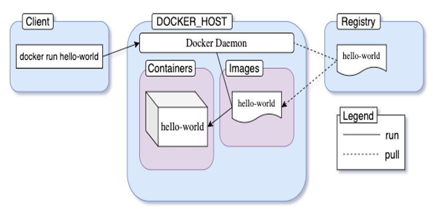
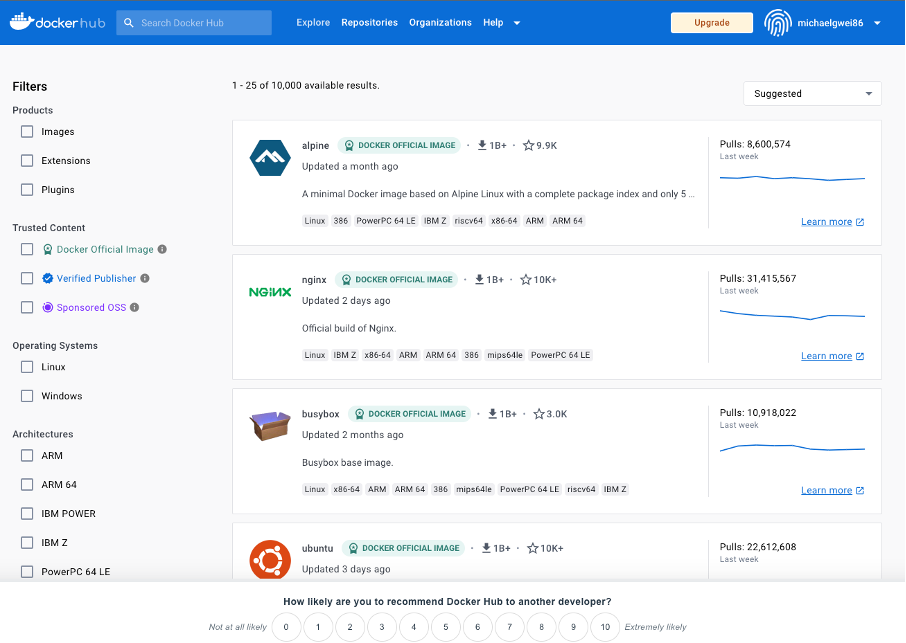

# Introduction to Docker

## What is Docker?

Docker is a commercial containerization platform and runtime that helps developers build, deploy, and run containers. It uses a client-server architecture with simple commands and automation through a single API.

- Docker also provides a toolkit that is commonly used to package applications into immutable container images by writing a `Dockerfile` and then running the appropriate commands to build the image using the Docker server. 
- Developers can create containers without Docker but the Docker platform makes it easier to do so. 
- These container images can then be deployed and run on any platform that supports containers, such as `Kubernetes`, `Docker Swarm`, `Mesos`, or `HashiCorp Nomad`.
- While Docker provides an efficient way to package and distribute containerized applications, running and managing containers at scale is a challenge with Docker alone. 
- Coordinating and scheduling containers across multiple servers/clusters, upgrading or deploying applications with zero downtime, and monitoring the health of containers are just some of the considerations that need to be made.


## Docker Architecture

Let’s understand how Docker as a software was designed. The engine consists of three major components:

-  **Docker Daemon**: The daemon (`dockerd`) is a process that keeps running in the background and waits for commands from the client. The daemon is capable of managing various Docker objects.
- **Docker Client**: The client (`docker`) is a command-line interface program mostly responsible for transporting commands issued by users.
- **REST API**: The REST API acts as a bridge between the daemon and the client. Any command issued using the client passes through the API to finally reach the daemon.

Docker uses a client-server architecture. The Docker client talks to the Docker daemon, which does the heavy lifting of building, running, and distributing your Docker containers.
Let’s look happens when you run the docker run hello-world command


This image is a slightly modified version of the one found in the official docs. The events that occur when you execute the command are as follows:
- - You execute docker run hello-world command where hello-world is the name of an image.
- -	Docker client reaches out to the daemon, tells it to get the hello-world image and run a container from that.
-  - Docker daemon looks for the image within your local repository and realizes that it's not there, resulting in the Unable to find image 'hello-world:latest' locally that's printed on your terminal.
- - The daemon then reaches out to the default public registry which is Docker Hub and pulls in the latest copy of the hello-world image, indicated by the latest: Pulling from library/hello-world line in your terminal.
- - Docker daemon then creates a new container from the freshly pulled image.
- - Finally, Docker daemon runs the container created using the hello-world image outputting the wall of text on your terminal.

## Docker Registry

An image registry is a centralized place where you can upload your images and can also download images created by others. Docker Hub is the default public registry for Docker. Another very popular image registry is Quay by Red Hat.


You can share any number of public images on Docker Hub for free. People around the world will be able to download them and use them freely. 

## Creating Dockerhub  Account

### Sign Up with Email Address
- Go to the Docker sign-up page https://registry.hub.docker.com/signup.
- Enter a unique, valid email address.
- Choose a username (`your Docker ID`) between 4 and 30 characters, containing only numbers and lowercase letters.
- Set a password (at least 9 characters long).
- Click “Sign Up.”
- Docker will send a verification email to the provided address. Verify your email to complete the registration process1.

### Sign Up with Google or GitHub
- Ensure your email address is verified with your social provider (Google or GitHub).
- Go to the Docker sign-up page https://registry.hub.docker.com/signup .
- Select your preferred social provider (Google or GitHub).
- Authorize Docker to access your social account information.
- Choose a username (`your Docker ID`).
- Click “Sign Up.”

### Sign In
After registering and verifying your Docker ID email address, you can sign in:
-  Use your email address (or username) and password.
- Alternatively, sign in with your social provider (Google or GitHub).
- You can also sign in through the CLI using the docker login command1.


## Installing  Docker on Amazon Linux Instance

Run the  following commands to install the docker deamon on an amazon  linux instance

```sh
#!/bin/bash
sudo yum update -y
sudo yum -y install docker
sudo service docker start
sudo systemctl enable docker.service 
sudo usermod -a -G docker ec2-user 
sudo chmod 666 /var/run/docker.sock

````
## Happy  Learning from Hilltop Consultancy
